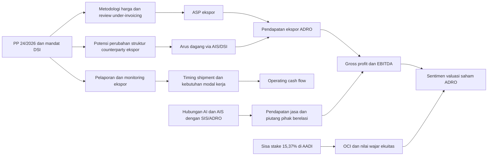

# Dampak Aturan Penentuan Harga PT Danantara Sumberdaya Indonesia terhadap Saham ADRO

## Ringkasan eksekutif

Saya menafsirkan nama yang Anda tulis sebagai **PT Danantara Sumberdaya Indonesia** atau **DSI**, karena itu nama yang dipakai dalam sumber resmi pemerintah dan Danantara. Dasar hukum utamanya adalah **PP Nomor 24 Tahun 2026 tentang Tata Kelola Ekspor Komoditas Sumber Daya Alam Strategis** yang tercatat di JDIH Setneg, dengan salinan PDF tersedia untuk diunduh di halaman detail regulasi, dan dijelaskan lagi melalui siaran pers resmi Danantara pada **5 Juni 2026**. Pemerintah menyatakan ekspor komoditas SDA strategis pada tahap awal meliputi **batu bara, kelapa sawit, dan ferro alloy**, dan pada tahap awal harus melalui **BUMN Ekspor**, yang diidentifikasi pemerintah sebagai DSI. citeturn33search4turn38search0turn33search2turn35view0

Temuan paling penting untuk ADRO adalah ini: **headline risk regulasinya besar, tetapi eksposur P&L langsung ADRO lebih kecil daripada yang tampak di permukaan** karena emiten ADRO saat ini adalah **PT Alamtri Resources Indonesia Tbk** (sebelumnya PT Adaro Energy Indonesia Tbk), dan bisnis batu bara termal telah dipisahkan ke **AADI** pada Desember 2024. Namun, ADRO masih memiliki **tiga kanal eksposur material**: **ekspor met coal** melalui bisnis pertambangan/mineral, **hubungan komersial besar dengan PT Adaro Indonesia dan Adaro International Singapore**, serta **sisa kepemilikan 15,37% di AADI** yang dicatat sebagai aset keuangan FVOCI. citeturn20search5turn15view0turn17view0turn44view3

Dalam model inti saya, saya hanya memasukkan **blok pendapatan ekspor yang dapat diverifikasi langsung** dari laporan tahunan ADRO 2025, yaitu **US$664,4 juta** atau sekitar **35,5%** dari pendapatan grup 2025. Dengan dasar itu, dampak jangka pendek **1–6 bulan** cenderung **terbatas dalam skenario dasar** selama DSI masih berfungsi terutama sebagai lapisan pelaporan dan monitoring. Tetapi dalam skenario negatif, bila metodologi harga DSI benar-benar menekan harga realisasi dan menimbulkan friksi volume, efek ke EBITDA ADRO bisa menjadi cukup nyata. citeturn14view0turn15view0turn25search12turn35view0

Hasil model saya menunjukkan, terhadap basis FY2025 ADRO, **skenario dasar** menghasilkan dampak kira-kira **-US$6,6 juta** terhadap pendapatan dan EBITDA, **skenario downside** sekitar **-US$52,2 juta pendapatan** dan **-US$40,6 juta EBITDA**, sedangkan **skenario upside** sekitar **+US$20,1 juta pendapatan** dan **+US$16,2 juta EBITDA**. Itu berarti isu ini **lebih merupakan risiko kebijakan dan valuasi** daripada risiko kehancuran laba jangka sangat pendek, tetapi sensitivitasnya tetap penting karena ADRO masih punya overlap komersial yang besar dengan grup AADI/AI/AIS. Basis keuangan yang saya pakai adalah pendapatan FY2025 **US$1,873,5 juta**, gross profit **US$636,6 juta**, EBITDA **US$799 juta**, dan arus kas operasi **US$594,1 juta**. citeturn14view0turn13view5turn25search12

Pandangan investasinya, karena itu, saya nilai **netral-cenderung hati-hati** untuk horizon 1–6 bulan. Untuk investor yang mencari “pure play” atas risiko aturan ekspor satu pintu, **ADRO bukan proksi yang paling langsung**; ironisnya, **AADI** dan juga eksposur eksportir komoditas primer lain lebih murni. Untuk investor yang ingin **buffer diversifikasi** terhadap shock aturan ekspor, ADRO relatif **lebih terlindungi** karena bisnisnya sekarang lebih terdiversifikasi ke jasa pertambangan, met coal, dan energi terbarukan. Ini adalah inferensi saya dari struktur usaha dan de-konsolidasi AADI, bukan pernyataan eksplisit manajemen. citeturn20search7turn25search1turn15view0

## Aturan baru DSI dan status resminya

Pengumuman resmi yang paling penting adalah **siaran pers Danantara Indonesia tertanggal 5 Juni 2026** berjudul *“Pelaksanaan PP Tata Kelola Ekspor Komoditas SDA Strategis: Danantara Indonesia Tegaskan Kepastian Berusaha dalam Pelaksanaan Mandat DSI”*. Dalam teks lengkap yang dapat diakses publik, Danantara menegaskan bahwa DSI akan menjalankan mandat tata kelola ekspor secara **terukur, profesional, dan akuntabel**, bahwa **kontrak yang telah ditandatangani dapat terus berjalan** selama **tidak terjadi under-invoicing**, dan bahwa masa transisi telah dimulai pada **1 Juni 2026**. Danantara juga menyatakan bahwa harga komoditas strategis akan ditetapkan berdasar **metodologi standar** yang **fair, transparent, and accountable**, dengan penyesuaian atas **kualitas, spesifikasi, biaya logistik, dan struktur kontrak**. Itu adalah sumber resmi terbaik untuk penjelasan operasional publik yang tersedia saat ini. citeturn35view0

Basis hukum formalnya adalah **PP Nomor 24 Tahun 2026 tentang Tata Kelola Ekspor Komoditas Sumber Daya Alam Strategis**. JDIH Setneg menampilkan judul regulasi tersebut di halaman detail resmi, dan snippet pencarian menyebut bahwa **“Salinan Pp Nomor 24 Tahun 2026.pdf”** tersedia untuk diunduh dari halaman yang sama. Karena web parser tidak memberi saya isi PDF pasal demi pasal secara stabil, saya memperlakukan halaman JDIH sebagai konfirmasi resmi eksistensi regulasi, sementara isi mekanisme saya sandarkan pada rangkaian ringkasan resmi Setneg/Danantara dan sumber Reuters yang merujuk pada regulasi yang sama. citeturn33search4turn38search0turn31news33

Setneg pada 20–21 Mei 2026 menjelaskan tujuan kebijakan ini dengan sangat gamblang. Presiden Prabowo menyebut PP itu sebagai langkah strategis untuk memperkuat tata kelola ekspor SDA, dan Setneg menulis bahwa ekspor komoditas SDA strategis hanya dapat dilakukan melalui **BUMN Ekspor yaitu PT Danantara Sumberdaya Indonesia** untuk memperkuat pengawasan, menjaga validitas dan integritas data perdagangan, serta menghilangkan praktik **trade misinvoicing**. citeturn33search0turn33search2turn33search10

Secara substansi, maka “aturan penentuan harga” yang Anda minta bukan tampaknya sebuah manual pricing tersendiri yang sudah dipublikasikan, melainkan **bagian dari PP 24/2026** yang kemudian dijelaskan oleh Danantara sebagai **metodologi harga per komoditas** yang akan diterapkan DSI. Artinya, **kerangka hukumnya sudah ada**, tetapi **formula operasional rinci** masih belum dipublikasikan penuh ke publik sampai tanggal riset ini. citeturn35view0turn31news33

## Mekanisme aturan dan area yang sudah jelas

Hal-hal yang sudah cukup jelas dari sumber resmi dan semi-resmi adalah sebagai berikut. **Subjek tahap pertama** adalah eksportir **batu bara, kelapa sawit, dan ferro alloy**. Reuters menambahkan bahwa cakupan komoditas dapat ditinjau **setiap tiga bulan** untuk kemungkinan penambahan komoditas lain. Setneg dan Danantara sama-sama menautkan peran DSI sebagai **BUMN ekspor satu pintu** untuk komoditas strategis. citeturn33search2turn28search17turn28search8turn35view0

**Tanggal efektif** juga makin konsisten di berbagai sumber. Danantara menyebut **masa transisi mulai 1 Juni 2026**. Reuters menulis bahwa sejak **1 Juni 2026** ekspor harus dirutekan melalui DSI dalam fase transisi, dan **mulai 1 Januari 2027** DSI ditargetkan menangani ekspor itu secara eksklusif. Antara juga menyebut fase pertama **1 Juni–31 Desember 2026** berfokus pada pengawasan pelaporan ekspor batu bara, sawit, dan ferro alloy. citeturn35view0turn31news33turn51news35turn51search5

**Mekanisme harga** adalah bagian yang paling sensitif. Dalam bahasa resmi Danantara, harga komoditas strategis akan ditentukan dengan **metodologi standar** yang fair, transparan, dan akuntabel, serta memperhitungkan **kualitas, spesifikasi, biaya logistik, dan struktur kontrak**. Reuters, yang merujuk pada regulasi yang telah diterbitkan dan lembar fakta pemerintah, menambahkan bahwa **harga dan margin** akan ditetapkan oleh BUMN pelaksana. Saya melihat dua hal penting di sini. Pertama, pemerintah memang ingin mengendalikan **benchmark kewajaran harga**. Kedua, sampai sekarang belum ada publikasi formula rinci yang memungkinkan pasar menghitung dengan presisi bagaimana kualitas premium, FOB/CFR, freight, diskon kontrak jangka panjang, dan faktor trader margin akan diperlakukan. citeturn35view0turn31news33turn28search17

**Kontrak yang sudah berjalan** menurut Danantara tetap dapat dilanjutkan **selama tidak ada under-invoicing**. Sumber media bisnis Indonesia yang merangkum PP juga menyebut bahwa kontrak penjualan yang ditandatangani sebelum 1 Juni 2026 akan dievaluasi oleh BUMN Ekspor. Bagi investor, ini berarti shock jangka pendek kemungkinan besar datang bukan dari pembatalan kontrak massal, tetapi dari **review kewajaran harga**, **pelaporan tambahan**, dan potensi **renegosiasi** pada transaksi yang dipandang terlalu jauh di bawah benchmark. citeturn35view0turn41search14turn51news34

**Pengecualian** tampaknya tersedia untuk pelaku usaha tertentu yang memiliki kontrak atau perjanjian dengan pemerintah, termasuk yang terkait investasi atau pengolahan di dalam negeri. Namun rincian siapa yang kondisi bisnisnya memenuhi pengecualian tetap akan bergantung pada koordinasi lintas kementerian dan aturan implementasi berikutnya. Reuters juga menyebut **Kementerian Perdagangan akan menerbitkan pedoman implementasi** lebih lanjut. citeturn31news33turn41search1turn41search11

**Penegakan** yang sudah diumumkan publik saat ini berpusat pada **digital reporting dan monitoring**. Danantara mengatakan DSI sedang membangun **platform digital** untuk menganalisis data transaksi ekspor agar indikasi under-invoicing terdeteksi objektif dan berbasis data. Yang **belum bisa saya verifikasi secara independen dari sumber resmi yang dapat diakses publik** adalah **skema sanksi atau penalti pasal demi pasal**. Karena pedoman teknis Kementerian Perdagangan masih akan diterbitkan, saya menilai isu penalti masih **terbuka** dan belum layak dipastikan lebih jauh dari ringkasan resmi yang ada saat ini. citeturn35view0turn31news33

### Tabel sumber dan tingkat kredibilitas

| Sumber | Jenis | Dipakai untuk | Kekuatan utama | Keterbatasan | Kredibilitas |
|---|---|---|---|---|---|
| Danantara Indonesia, siaran pers 5 Jun 2026 citeturn35view0 | Resmi | Mekanisme transisi, kontrak, metodologi harga | Sumber resmi paling rinci tentang implementasi DSI | Tidak memuat formula harga pasal demi pasal | Sangat tinggi |
| JDIH Setneg, detail PP 24/2026 citeturn33search4turn38search0 | Resmi | Konfirmasi dasar hukum, judul PP, keberadaan salinan PDF | Bukti legal formal adanya PP | Isi lengkap PDF tidak seluruhnya ter-parse | Sangat tinggi |
| Setneg 20–21 Mei 2026 citeturn33search0turn33search2turn33search10 | Resmi | Tujuan kebijakan, penunjukan DSI, narasi pemerintah | Menjelaskan intent kebijakan secara eksplisit | Tidak cukup detail untuk formula teknis | Sangat tinggi |
| AlamTri Annual Report 2025 citeturn14view0turn15view0turn17view0turn44view3 | Resmi emiten | Basis keuangan ADRO, overlap AI/AIS, retained stake AADI | Data keuangan audit dan pengungkapan pihak berelasi | Belum mencakup dampak PP 24/2026 karena periodenya FY25 | Sangat tinggi |
| Halaman resmi AlamTri Services & Mining citeturn49search2turn49search9 | Resmi emiten | Customer overlap, peran SIS di AI | Mengikat secara komersial dan operasional | Tidak memberi nilai kontrak/volume detail | Tinggi |
| Halaman resmi AADI dan annual report snippet citeturn48search6turn48search10turn46search0turn48search3 | Resmi emiten | Struktur AADI, AI, AIS | Mengonfirmasi entitas thermal coal/logistics yang beririsan dengan ADRO | Snippet terbatas, tidak semua file mudah dibuka | Tinggi |
| Reuters 20 Mei–5 Jun 2026 citeturn28search8turn28search17turn31news33turn51news34turn51news35 | Media global | Tahapan implementasi, reaksi pasar, guideline pending | Independen, cepat, konsisten antarlaporan | Tetap sumber sekunder | Tinggi |
| Investing historical data untuk ADRO/AADI citeturn27view0turn50search2 | Data pasar | Harga saham, intraday/high-low/volume | Baik untuk chart dan reaction testing | Bukan sumber resmi bursa | Sedang |

## Pemetaan hubungan komersial DSI dengan ADRO

Sebelum menilai dampak saham, struktur ADRO harus diluruskan dulu. **ADRO saat ini adalah ticker PT Alamtri Resources Indonesia Tbk**, dan dalam annual report 2025 perusahaan menjelaskan bahwa pada **9–11 Desember 2024** perseroan menjual mayoritas kepemilikannya di AADI melalui PUPS, lalu menyisakan **15,37%** kepemilikan yang dicatat sebagai **aset keuangan pada nilai wajar melalui OCI** karena tidak lagi memiliki pengaruh signifikan. Annual report yang sama juga menunjukkan saldo **financial assets at FVOCI** sebesar **US$497,5 juta** per 31 Desember 2025. citeturn15view0turn17view0turn20search5

Karena itu, ADRO **bukan lagi eksportir batu bara termal yang sama seperti sebelum spin-off**. Bisnis yang masih terkonsolidasi di ADRO pada 2025 terutama adalah **metallurgical coal/mining**, **mining services**, dan **others**. Segmen 2025 menunjukkan external revenue **US$966,3 juta** untuk mining, **US$865,3 juta** untuk mining services, dan **US$41,9 juta** untuk others. Total penjualan berdasarkan tujuan adalah **domestik US$1.209,1 juta** dan **ekspor US$664,4 juta**. Dengan kata lain, eksposur langsung yang paling “bersih” ke aturan DSI di laporan ADRO 2025 adalah blok **ekspor US$664,4 juta** itu. citeturn14view0turn15view0

Namun overlap komersialnya dengan grup eks-thermal-coal tetap besar. ADRO mengungkapkan bahwa **FY25 revenue from related parties** mencapai **US$1,388 miliar**, setara sekitar **74%** dari total pendapatan grup. Rinciannya sangat penting: **US$720,4 juta** berasal dari **PT Adaro Indonesia (AI)** dan **US$477,5 juta** dari **Adaro International Singapore Pte. Ltd. (AIS)**. Jadi hanya dari **AI + AIS** saja, nilainya sekitar **US$1,198 miliar**, atau kira-kira **63,9%** dari total pendapatan ADRO FY25. Annual report juga menyebut kebijakan harga transaksi pihak berelasi ditetapkan berdasarkan **contracted prices**, dan untuk penjualan batu bara kepada pihak berelasi merujuk pada **applicable benchmarks**. Ini sangat relevan karena DSI justru masuk di titik benchmark, kewajaran harga, dan review kontrak ekspor. citeturn44view3

Hubungan operasional itu juga terlihat di halaman resmi bisnis jasa ADRO. **PT Saptaindra Sejati (SIS)** disebut sebagai salah satu kontraktor tambang terbesar Indonesia, dan **pelanggan utamanya adalah Adaro Indonesia, Balangan Coal Companies, dan Maruwai Coal**. Halaman mining ADRO juga menjelaskan bahwa **AI mempekerjakan tiga kontraktor tambang, salah satunya SIS**, yang merupakan anak usaha ADRO. Artinya, kendati batu bara termal sudah tidak lagi terkonsolidasi penuh di ADRO, ADRO tetap **mendapatkan revenue layanan** dari simpul-simpul bisnis batu bara termal yang sekarang lebih dekat ke AADI. citeturn49search2turn49search9

Dari sisi AADI, halaman sejarah resmi menyebut perusahaan mengakuisisi **PT Adaro Indonesia** pada 2005, dan profil perusahaan di IDX menunjukkan AADI memiliki **PT Adaro Indonesia 88,47%**. Snippet annual report AADI 2024 juga menyatakan **Adaro International (Singapore) Pte. Ltd.** adalah subsidiari dalam grup itu. Ini memperkuat bacaan bahwa overlap ADRO–AADI bukan asumsi longgar, tetapi jejak komersial yang masih nyata. citeturn48search6turn48search9turn46search0

Yang **tidak** saya temukan di annual report ADRO FY2025 adalah pengungkapan **kontrak langsung** atau **JV yang sudah diumumkan** antara ADRO dan DSI. Pencarian kata “Danantara”, “Sumberdaya Indonesia”, dan “PT Danantara” di annual report ADRO FY2025 tidak menghasilkan kecocokan. Jadi hubungan yang saat ini bisa diverifikasi adalah **hubungan regulatori dan aliran dagang**, bukan hubungan counterparty kontraktual yang sudah diumumkan ke publik. citeturn44view0turn44view1turn44view2turn35view0

## Analisis dampak finansial dan skenario

Model inti saya memakai pendekatan **konservatif** agar tidak double-count. Saya **tidak** memodelkan seluruh US$1,388 miliar related-party revenue sebagai blok terdampak, karena sebagian besar nilai itu kemungkinan sudah terwakili dalam penjualan mining/services dan ada risiko menghitung dampak dua kali. Saya juga **tidak** langsung memasukkan re-pricing AADI stake ke EBITDA, karena retained stake AADI dicatat sebagai **FVOCI**, jadi dampaknya terutama ke **OCI/ekuitas**, bukan ke EBITDA inti. Dengan demikian, saya memusatkan skenario pada **blok ekspor ADRO 2025 sebesar US$664,4 juta**, yang merupakan proksi paling bersih untuk transaksi yang bisa terkena jalur DSI. Basis grup FY2025 yang saya pakai adalah revenue **US$1,873,5 juta**, gross profit **US$636,6 juta**, EBITDA **US$799 juta**, dan operating cash flow **US$594,1 juta**. citeturn14view0turn13view5turn25search12

Untuk baseline margin blok ekspor, saya proksikan blok itu dengan economics segmen mining tahun 2025, karena ekspor ADRO 2025 hampir pasti didominasi komoditas pertambangan. Dari segmen mining FY2025, saya peroleh gross profit margin sekitar **40,7%** dan EBITDA margin sekitar **41,8%**. Hasilnya, baseline economics untuk blok ekspor adalah kira-kira **US$270,4 juta gross profit** dan **US$277,9 juta EBITDA**. Ini adalah model saya, berbasis angka emiten yang telah diaudit, bukan guidance resmi manajemen atas kebijakan DSI. citeturn14view0

Secara praktis, sensitivitasnya cukup mudah dibaca. Dalam model ini, **setiap penurunan 1% harga realisasi ekspor** menggerus sekitar **US$6,6 juta** revenue dan, dalam jangka pendek, kurang lebih **US$6,6 juta EBITDA** pada blok ekspor. Sementara **setiap penurunan 1% volume ekspor** menggerus sekitar **US$2,8 juta EBITDA**. Saya kemudian mengonversi dampak EBITDA ke arus kas operasi memakai rasio konversi FY2025 ADRO sekitar **74,4%** dari OCF terhadap EBITDA. Basis dan asumsi ini saya pakai untuk tiga skenario berikut. citeturn14view0turn13view5

### Tabel skenario utama

| Skenario | Asumsi harga ekspor | Asumsi volume ekspor | Perubahan revenue | Perubahan gross profit | Perubahan EBITDA | Perubahan operating cash flow | Revenue total pasca-skenario | EBITDA total pasca-skenario |
|---|---:|---:|---:|---:|---:|---:|---:|---:|
| Base | -1% | 0% | -US$6,6m | -US$6,6m | -US$6,6m | -US$4,9m | US$1.866,9m | US$792,4m |
| Downside | -5% | -3% | -US$52,2m | -US$40,3m | -US$40,6m | -US$30,2m | US$1.821,4m | US$758,4m |
| Upside | +2% | +1% | +US$20,1m | +US$16,1m | +US$16,2m | +US$12,0m | US$1.893,6m | US$815,2m |

Dalam pembacaan saya, **base case** adalah yang paling realistis untuk 1–6 bulan, karena Danantara sendiri menekankan transisi, kualitas pelaporan, dan keberlanjutan kontrak, bukan disrupsi ekspor mendadak. **Downside case** menjadi relevan bila pedoman Kemendag ternyata menegaskan bahwa DSI akan bertindak sebagai legal seller/counterparty yang menetapkan margin ketat, atau bila review under-invoicing meluas ke negosiasi ulang harga kontrak. **Upside case** masuk akal bila metodologi harga justru mengakui kualitas premium, logistics differentiation, dan struktur kontrak secara fair, sehingga eksportir yang selama ini sudah dekat benchmark tidak mengalami diskon tambahan. citeturn35view0turn31news33turn51news35

### Sensitivitas EBITDA terhadap kombinasi harga dan volume

| Perubahan harga ekspor | Volume -3% | Volume 0% | Volume +1% |
|---|---:|---:|---:|
| -5% | -US$40,6m | -US$33,2m | -US$30,8m |
| -1% | -US$14,8m | -US$6,6m | -US$3,9m |
| +2% | +US$4,6m | +US$13,3m | +US$16,2m |

Ada satu lapisan tambahan yang tidak saya masukkan ke tabel utama agar tidak terjadi double-count, tetapi tetap penting bagi investor. Karena ADRO mencatat **financial assets at FVOCI US$497,5 juta** dan retained stake **15,37% di AADI** sebagai FVOCI, maka **setiap re-pricing besar atas AADI** berpotensi menggeser **OCI/ekuitas** ADRO meskipun tidak langsung masuk ke EBITDA. Sebagai ilustrasi kasar, **10%** perubahan nilai wajar atas saldo FVOCI tersebut setara sekitar **US$49,8 juta** perubahan OCI, dengan asumsi saldo FVOCI FY2025 terutama merepresentasikan retained stake AADI. Itu adalah asumsi yang saya nyatakan eksplisit, bukan pengungkapan resmi manajemen. citeturn17view0turn15view0

## Timeline peristiwa dan reaksi pasar

Secara kronologis, shock kebijakan dimulai pada **20 Mei 2026** ketika Presiden Prabowo mengumumkan penerbitan PP tata kelola ekspor SDA strategis. Pada hari yang sama, Reuters melaporkan rencana sentralisasi ekspor komoditas utama melalui entitas di bawah Danantara, dan ADRO ditutup di **Rp2.230**, turun **4,29%** dari sehari sebelumnya, dengan **volume 170,5 juta saham** dan rentang intraday **Rp2.140–Rp2.320**. Bagi saya, ini menandakan pasar langsung men-discount risiko regulasi, bahkan sebelum detail implementasinya jelas. citeturn33search0turn28search8turn27view0

Pada **21 Mei 2026**, Setneg menegaskan bahwa seluruh ekspor komoditas SDA strategis akan melalui DSI untuk menghilangkan trade misinvoicing, sementara Reuters mengutip Danantara bahwa kontrak yang ada akan dihormati selama tidak terjadi under-invoicing. Reaksi saham ADRO hari itu tetap negatif, dengan penutupan di **Rp2.210** atau **-0,90%**. Sehari kemudian, **22 Mei 2026**, saham ADRO justru melonjak ke **Rp2.350** atau **+6,33%**, menunjukkan bahwa pasar sedang menimbang ulang apakah kebijakan itu akan benar-benar disruptif atau hanya menambah lapisan pengawasan. citeturn33search2turn31search13turn27view0

Menjelang implementasi, pemerintah dan Kemenko Perekonomian pada akhir Mei menekankan kesiapan operasional DSI. Reuters pada **1 Juni 2026** menulis bahwa fase transisi telah dimulai, bahwa eksportir untuk saat ini hanya perlu melaporkan dokumentasi ekspor ke DSI, dan implementasi penuh baru ditargetkan **1 Januari 2027**. Namun pada **2 Juni 2026**, asosiasi pengusaha yang dikutip Reuters meminta kejelasan teknis mengenai kontrak jangka panjang, pembayaran, pengapalan, asuransi, dan platform digital. ADRO lalu ditutup **Rp2.280** pada 2 Juni dan jatuh lagi ke **Rp2.180** pada **3 Juni 2026** atau **-4,39%** dengan volume **111 juta saham**. Itu konsisten dengan pola “headline risk kembali naik setiap kali detail aturan terlihat belum matang.” citeturn30search0turn51news35turn51news34turn27view0

Pada **5 Juni 2026**, Danantara menerbitkan siaran pers resmi yang lebih menenangkan, menekankan business continuity, confidentiality, dan metodologi harga yang fair. Meski begitu, jalur harga ADRO tetap bergejolak: setelah rebound ke **Rp2.270** pada 4 Juni (**+4,13%**), ADRO ditutup **Rp2.240** pada **5 Juni 2026** (**-1,32%**). Jika ditarik **1 minggu**, dari **29 Mei** ke **5 Juni**, ADRO turun sekitar **2,6%**. Jika ditarik **1 bulan**, dari **4 Mei** ke **5 Juni**, ADRO turun sekitar **10,4%**. Saya tidak akan mengatribusikan seluruh penurunan itu hanya kepada DSI, tetapi kebijakan ini jelas menjadi salah satu katalis negatif utama di periode tersebut. citeturn35view0turn27view0

Grafik di atas memvisualisasikan data penutupan harian ADRO dari **4 Mei hingga 5 Juni 2026**. Pola yang terlihat cukup jelas adalah penurunan tajam di sekitar pengumuman **20 Mei**, pemantulan teknikal singkat, lalu kelemahan lagi ketika fase transisi dimulai dan pasar menunggu detail implementasi yang lebih konkret. Data historis harian, termasuk open-high-low-close dan volume, berasal dari halaman historical data ADRO yang saya gunakan sebagai basis chart ini. citeturn27view0

### Ringkasan timeline dan market reaction

| Tanggal | Peristiwa | Market reaction ADRO |
|---|---|---|
| 20 Mei 2026 | Presiden umumkan PP tata kelola ekspor SDA strategis; Reuters laporkan rencana sentralisasi ekspor komoditas utama lewat entitas Danantara. citeturn33search0turn28search8 | Tutup di Rp2.230, **-4,29%**; low Rp2.140; volume 170,5 juta. citeturn27view0 |
| 21 Mei 2026 | Setneg tegaskan ekspor komoditas strategis hanya via DSI; Danantara bilang existing contracts tetap jalan bila tidak under-invoicing. citeturn33search2turn31search13 | Tutup di Rp2.210, **-0,90%**. citeturn27view0 |
| 22 Mei 2026 | Pasar mencerna kebijakan dan ketidakjelasan implementasi; investor mulai bargain hunting. citeturn51search22 | Tutup di Rp2.350, **+6,33%**. citeturn27view0 |
| 1 Juni 2026 | Masa transisi resmi dimulai; fokus awal pada pelaporan dan monitoring. citeturn35view0turn51news35 | 2 Juni ADRO tutup Rp2.280, **-0,87%**. citeturn27view0 |
| 2 Juni 2026 | Kelompok usaha minta kejelasan teknis atas kontrak, pembayaran, pengapalan, asuransi, dan platform digital. citeturn51news34 | 3 Juni ADRO tutup Rp2.180, **-4,39%**. citeturn27view0 |
| 5 Juni 2026 | Danantara rilis penjelasan resmi paling rinci sejauh ini; Reuters laporkan regulasi sudah diterbitkan dan guideline Kemendag masih menyusul. citeturn35view0turn31news33 | 4 Juni naik **+4,13%**, 5 Juni turun **-1,32%** ke Rp2.240. citeturn27view0 |

## Rekomendasi investor dan trigger pemantauan

Untuk investor saham ADRO, kesimpulan praktis saya adalah **jangan memperlakukan DSI sebagai “semua atau tidak sama sekali.”** Risiko yang paling nyata bukan bahwa laba ADRO akan langsung runtuh pada kuartal berikutnya, melainkan bahwa **discount rate pasar naik** karena regulasi baru menambah opacity pada pricing, counterparty structure, dan cash-conversion. Itu alasan mengapa saya condong ke sikap **netral–cautious** ketimbang bearish ekstrem. ADRO sekarang memang bukan lagi kendaraan termal murni, tetapi overlap bisnisnya dengan AI/AIS/AADI masih terlalu besar untuk diabaikan. citeturn15view0turn44view3turn35view0

Jika saya memposisikan saham ini untuk horizon **1–6 bulan**, saya akan memperlakukan ADRO sebagai emiten yang **relatif lebih terlindungi** dibanding AADI terhadap shock kebijakan ekspor satu pintu, tetapi **masih cukup terdampak** untuk kehilangan rerating jangka pendek bila pedoman teknis ternyata keras. Dengan kata lain, **ADRO lebih cocok untuk investor yang percaya pada buffer diversifikasi**, bukan untuk investor yang mencari timing trading dari pure play batu bara termal. Ini adalah inferensi saya dari struktur bisnis ADRO pasca spin-off AADI, distribusi revenue, dan eksposur pihak berelasi. citeturn20search7turn25search1turn44view3

### Trigger yang paling perlu dipantau

| Trigger | Kenapa penting untuk ADRO | Interpretasi pasar |
|---|---|---|
| Permendag/pedoman implementasi resmi | Akan menentukan apakah DSI hanya supervisor/intermediary atau menjadi legal counterparty yang benar-benar menetapkan margin | Pedoman yang lebih lunak = positif; pedoman yang lebih ketat = negatif |
| Perlakuan kontrak lama sebelum 1 Juni 2026 | ADRO dan counterparties seperti AI/AIS sangat sensitif pada risk renegotiation | Grandfathering penuh = positif; review harga agresif = negatif |
| Formula harga DSI per komoditas | ADMR met coal bisa terdampak berbeda dari thermal coal bila kualitas/logistik diakui | Quality-adjusted formula = lebih baik untuk ADRO |
| Pengungkapan ADRO/ADMR soal realized price ekspor | Ini bukti paling langsung apakah rule menekan ASP | ASP yang tetap dekat benchmark = meredakan risiko |
| Pergerakan piutang dan revenue pihak berelasi AI/AIS | AI dan AIS menyumbang porsi besar revenue ADRO FY25 | DSO/piutang naik atau revenue melemah = sinyal warning |
| Pergerakan harga AADI dan perubahan nilai FVOCI | Mempengaruhi OCI/ekuitas ADRO, walau bukan EBITDA inti | AADI stabil/naik = bantalan valuasi ADRO |

Rekomendasi operasional saya: **hold** bagi investor yang sudah punya ADRO dan bisa menahan volatilitas kebijakan, **wait-and-see** bagi investor baru sampai aturan teknis terbit, dan **accumulate on clarity** hanya bila dua hal terjadi bersamaan: pertama, DSI dikonfirmasi tetap bersifat intermediary setidaknya sepanjang 2026; kedua, ADRO/ADMR menunjukkan tidak ada penurunan material pada harga realisasi ekspor atau cash collection dari AI/AIS. Sebaliknya, bila pasar mendapat bukti bahwa DSI akan menjadi penjual utama dengan penetapan margin yang ketat, saya akan menilai risiko downside skenario negatif meningkat cepat. citeturn35view0turn31news33turn51news34

## Keterbatasan dan pertanyaan terbuka

Ada beberapa area yang **belum bisa dipastikan** dari dokumen resmi yang dapat diakses publik sampai **6 Juni 2026**. Pertama, saya **belum dapat memverifikasi teks pasal demi pasal** dari salinan PDF PP 24/2026 melalui parser web, meskipun JDIH Setneg mengonfirmasi eksistensi regulasi dan file unduhannya. Kedua, **formula pricing detail** DSI per komoditas belum dipublikasikan secara lengkap ke publik; yang ada baru kerangka metodologinya. Ketiga, **skema penalti/sanksi** yang rinci juga belum bisa saya verifikasi secara memadai dari sumber resmi yang dapat diakses publik, dan Reuters menyatakan pedoman implementasi Kemendag masih akan diterbitkan. citeturn38search0turn35view0turn31news33

Karena itu, ada tiga pertanyaan terbuka yang paling menentukan valuasi ADRO ke depan. **Apakah met coal ADMR akan diperlakukan identik dengan thermal coal atau ada treatment berbeda?** **Apakah AIS/AI akan tetap menjadi simpul komersial utama atau sebagian besar fungsi pricing/marketing berpindah ke DSI?** **Apakah retained stake AADI akan menjadi buffer valuasi atau justru sumber volatilitas OCI tambahan?** Sampai ada jawaban yang lebih tegas dari pedoman teknis dan pengungkapan emiten, saya menganggap ADRO sebagai saham dengan **risiko kebijakan menengah**, bukan rendah. citeturn33search2turn35view0turn44view3