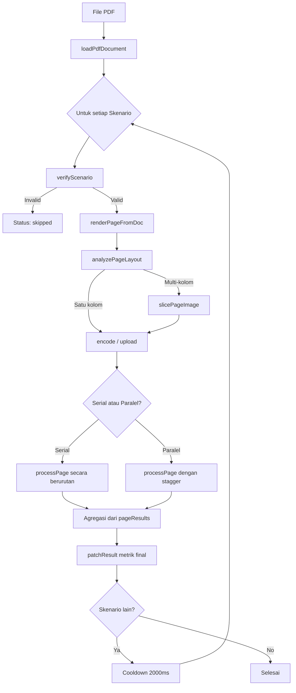

> **Sumber**: [`src/hooks/useBenchmark.ts`](https://github.com/msyamsudin/PustakaKu-MD/blob/main/src/hooks/useBenchmark.ts) + [`src/lib/utils/types.ts`](https://github.com/msyamsudin/PustakaKu-MD/blob/main/src/lib/utils/types.ts)
> **Versi**: 6 (2026-05-19)

> **Tujuan**: Referensi audit untuk model AI dan developer dalam meninjau akurasi metrik benchmark.

---

## 1. Ikhtisar Sistem

Sistem benchmark mengukur performa model AI vision dalam mengekstraksi markdown dari gambar halaman PDF. Sistem mendukung berbagai penyedia (Ollama, OpenRouter, Google, Anthropic), tiga mode transportasi gambar, deteksi layout multi-kolom otomatis, serta eksekusi serial maupun paralel.

### Diagram Arsitektur



### Definisi Tipe Data

```typescript
// src/lib/utils/types.ts

export interface BenchmarkScenario {
  id: string;              // contoh: "google-base64", "openrouter-supabase"
  label: string;           // Nama yang mudah dibaca
  provider: Provider;
  imageInputMode: ImageInputMode;
}

export type BenchmarkStatus = "pending" | "running" | "done" | "error" | "skipped" | "partial";

/** Hasil per halaman yang dikumpulkan selama ekstraksi batch */
export interface BenchmarkPageResult {
  pageNum: number;
  uploadDurationMs?: number;   // fase encode / upload untuk halaman ini
  ttftMs?: number;             // time-to-first-token
  durationMs?: number;         // total waktu untuk halaman ini
  promptTokens?: number;
  completionTokens?: number;
  requestPayloadKb?: number;   // ukuran request body AI final (metadata + image/url)
  imageSizeKb?: number;        // ukuran mentah data gambar
  payloadEfficiency?: number;  // (imageSize - payloadSize) / imageSize * 100
  width?: number;
  height?: number;
  markdown?: string;           // output mentah yang digunakan untuk kalkulasi CPS
  cost?: number;               // biaya dari API untuk halaman ini (USD)
  errorMessage?: string;
}

/** Hasil teragregasi untuk satu skenario di semua halaman benchmark */
export interface BenchmarkResult {
  scenarioId: string;
  label: string;
  status: BenchmarkStatus;
  isParallel?: boolean;

  // Agregat lintas halaman
  pagesProcessed: number;
  pagesFailed: number;

  // Timing (ms)
  totalDurationMs?: number;
  avgTtftMs?: number;
  minTtftMs?: number;
  maxTtftMs?: number;
  stdDevTtftMs?: number;
  avgUploadMs?: number;
  minUploadMs?: number;
  maxUploadMs?: number;
  stdDevUploadMs?: number;

  // Penggunaan token (dijumlahkan)
  promptTokens?: number;
  completionTokens?: number;
  totalTokens?: number;
  avgTokensPerPage?: number;
  tps?: number;                // Tokens Per Second
  cps?: number;                // Characters Per Second (v6)
  modelUsed?: string;

  // Biaya (USD, dijumlahkan)
  estimatedCostUsd?: number;

  // Jaringan (rata-rata per halaman)
  avgPayloadKb?: number;
  avgImageSizeKb?: number;
  avgPayloadEfficiency?: number;

  // Kualitas output
  totalOutputChars?: number;   // Total karakter markdown yang dihasilkan (v6)

  // Rincian per halaman
  pageResults: BenchmarkPageResult[];

  // Pelacakan real-time
  currentTask?: string;
  taskStartTime?: number;

  // Error level skenario
  errorMessage?: string;
}
```

---

## 2. Validasi Pra-Eksekusi (`verifyScenario`)

Sebelum skenario berjalan, kredensial dan konfigurasi model divalidasi. Skenario akan **di-skip** (bukan error) jika validasi gagal.

| Provider | Field Wajib | Catatan |
|---|---|---|
| `google` | `googleApiKey` | Model dicek via `googleModel \|\| selectedModel` |
| `anthropic` | `anthropicApiKey` | Model dicek via `anthropicModel \|\| selectedModel` |
| `openrouter` | `openRouterKey` + model | Validasi juga config Supabase jika `imageInputMode === "supabase"` |
| `ollama` | `ollamaModel \|\| selectedModel` | Tidak butuh API key (lokal). Hanya mendukung mode `base64` secara lokal. |

### Source Code

```typescript
// useBenchmark.ts L34-88
export function verifyScenario(
  scenario: BenchmarkScenario
): { valid: boolean; reason?: string } {
  const cfg = getConfig();

  if (scenario.provider === "google") {
    if (!cfg.googleApiKey?.trim()) {
      return { valid: false, reason: "Google API Key not configured in Settings." };
    }
  }

  if (scenario.provider === "anthropic") {
    if (!cfg.anthropicApiKey?.trim()) {
      return { valid: false, reason: "Anthropic API Key not configured in Settings." };
    }
  }

  if (scenario.provider === "ollama") {
    if (!cfg.ollamaModel?.trim() && !cfg.selectedModel?.trim()) {
      return { valid: false, reason: "Ollama model not configured in Settings." };
    }
    return { valid: true };
  }

  if (scenario.provider === "openrouter") {
    if (!cfg.openRouterKey?.trim()) {
      return { valid: false, reason: "OpenRouter API Key not configured in Settings." };
    }
    if (!cfg.openRouterModel?.trim() && !cfg.selectedModel?.trim()) {
      return { valid: false, reason: "OpenRouter model not configured." };
    }
    if (scenario.imageInputMode === "supabase") {
      if (!cfg.supabaseProjectId?.trim()) {
        return { valid: false, reason: "Supabase Project ID not configured." };
      }
      if (!cfg.supabaseServiceKey?.trim()) {
        return { valid: false, reason: "Supabase Service Key not configured." };
      }
    }
  }

  // Final: pastikan setidaknya satu model bisa di-resolve untuk provider ini
  const resolvedModel =
    (scenario.provider === "google" && cfg.googleModel?.trim()) ||
    (scenario.provider === "openrouter" && cfg.openRouterModel?.trim()) ||
    (scenario.provider === "anthropic" && cfg.anthropicModel?.trim()) ||
    cfg.selectedModel?.trim();

  if (!resolvedModel) {
    return { valid: false, reason: "No model selected in Settings." };
  }

  return { valid: true };
}
```

---

## 3. Mode Input Gambar

Setiap skenario menentukan bagaimana gambar dikirim ke AI provider:

| Mode | Transportasi | Nilai `base64Image` | Nilai `imageUrl` | Ukuran `requestPayloadKb` |
|---|---|---|---|---|
| `base64` | Inline Base64 | Data URI lengkap | `undefined` | Ukuran string Base64 |
| `supabase` | Signed URL | `""` (kosong) | URL Supabase | Ukuran string URL |
| `google_files` | Google Files API | `""` (kosong) | URI file Google | Ukuran string URI |

> [!NOTE]
> Mode `supabase` didukung penuh untuk provider `openrouter` (sebagai transportasi gambar eksternal via URL). Validasi Supabase hanya dijalankan jika `imageInputMode === "supabase"`.

---

## 4. Deteksi Layout Multi-Kolom (v6)

Sebelum fase encoding/upload, setiap halaman dianalisis menggunakan `analyzePageLayout` untuk mendeteksi apakah halaman memiliki tata letak multi-kolom.

### Alur Deteksi

```typescript
// useBenchmark.ts — di dalam processPage
if (cfg.enableColumnDetection !== false) {
  const layout = await analyzePageLayout(await pdfDoc.getPage(pageNum));
  if (layout.isMultiColumn) {
    const { slices, labels } = await slicePageImage(pageBlob, layout.regions);
    result = await extractMarkdownWithSlicing({
      ...extractionOptions,
      slices,
      labels,
      onSliceStart: (label) => {
        patchResult(scenario.id, { currentTask: `Extracting ${label} (pg. ${pageNum})...` });
      }
    });
  } else {
    result = await extractMarkdown(extractionOptions);
  }
} else {
  result = await extractMarkdown(extractionOptions);
}
```

### Penjelasan

| Komponen | Fungsi |
|---|---|
| `analyzePageLayout` | Menganalisis struktur kolom halaman PDF via `pdfDoc.getPage()` |
| `layout.isMultiColumn` | `true` jika halaman terdeteksi multi-kolom |
| `layout.regions` | Array area koordinat untuk setiap kolom |
| `slicePageImage` | Memotong `pageBlob` menjadi beberapa irisan sesuai region kolom |
| `extractMarkdownWithSlicing` | Mengirimkan setiap irisan secara terpisah ke AI, lalu menggabungkan hasilnya |

> [!IMPORTANT]
> Deteksi kolom aktif secara default (`enableColumnDetection !== false`). Fitur ini dapat dinonaktifkan dari Settings. Ketika dinonaktifkan, seluruh halaman selalu dikirim sebagai satu gambar.

---

## 5. Arsitektur Timing

### A. Diagram Siklus Hidup Halaman

```
│◀──────────── durationMs ──────────────────────────────────────▶│
│                                                                 │
│◀── uploadDurationMs ──▶│◀────────── Siklus Hidup AI ───────────▶│
│                        │                                        │
│  render + encode/upload│  request ──▶ TTFT ──▶ stream ──▶ done  │
│                        │            │                           │
uploadStart          aiStart     firstChunk              completion
```

> [!NOTE]
> Waktu render PDF (`renderPageFromDoc`) dilakukan **sebelum** `uploadStart` dicatat. Fase ini tidak masuk dalam durasi benchmark AI.

### B. Timestamp Utama (per halaman)

| Variabel | Kapan Diatur | Apa yang Diukur |
|---|---|---|
| `uploadStart` | Sebelum persiapan gambar dimulai | Awal fase persiapan + upload |
| `aiStart` | Setelah upload, sebelum `extractMarkdown()` | Awal siklus request AI |
| `firstChunk` | Callback `onChunk` pertama dipicu | Kedatangan token stream pertama |
| `uploadDurationMs` | `performance.now() - uploadStart` | Durasi fase persiapan + upload saja |
| `ttftMs` | `performance.now() - aiStart` | Waktu dari request AI hingga token pertama |
| `durationMs` | `performance.now() - uploadStart` | **Total** waktu wall-clock untuk halaman ini |

---

## 6. Model Konkurensi

### A. Mode Serial
Halaman diproses satu per satu dalam loop `for`. Keluar lebih awal jika user menekan `stopBenchmark()` atau membatalkan proses.

### B. Mode Paralel (Staggered Pool)

```typescript
// useBenchmark.ts L422-426
if (options?.isParallel) {
  const tasks = Array.from({ length: pageNums.length }, async (_, i) => {
    if (i > 0) await new Promise(r => setTimeout(r, i * STAGGER_MS));
    return processPage(i);
  });
  await Promise.all(tasks);
}
```

- **`STAGGER_MS`**: `200ms` — mencegah hantaman API simultan yang bisa memicu rate limit.

---

## 7. Formula Statistik

### A. Tokens Per Second (TPS)

Formula berbeda berdasarkan mode eksekusi:

**Mode Serial — Kecepatan Generasi Model:**

$$TPS_{serial} = \frac{\sum completionTokens_{sukses}}{\sum (durationMs - uploadDurationMs)_{sukses} \div 1000}$$

**Mode Paralel — Throughput Sistem:**

$$TPS_{paralel} = \frac{\sum completionTokens_{sukses}}{(lastPageEndMs - firstPageStartMs) \div 1000}$$

> [!IMPORTANT]
> Dalam mode paralel, penyebutnya adalah rentang wall-clock dari mulai halaman pertama hingga akhir halaman terakhir. Ini mengukur berapa banyak token yang dihasilkan sistem per detik waktu nyata.

### B. Characters Per Second (CPS) — v6

CPS menggunakan formula yang identik dengan TPS, namun mengganti `completionTokens` dengan jumlah karakter markdown output (`markdown.length`). Metrik ini bersifat **tokenizer-agnostic** — valid untuk membandingkan model dari provider berbeda yang memiliki ukuran token berbeda.

**Mode Serial — Kecepatan Generasi Karakter:**

$$CPS_{serial} = \frac{\sum markdown.length_{sukses}}{\sum (durationMs - uploadDurationMs)_{sukses} \div 1000}$$

**Mode Paralel — Throughput Karakter Sistem:**

$$CPS_{paralel} = \frac{\sum markdown.length_{sukses}}{(lastPageEndMs - firstPageStartMs) \div 1000}$$

### C. Implementasi Bersama

```typescript
// useBenchmark.ts L488-502
const totalOutputChars = successPages.reduce((acc, p) => acc + (p.markdown?.length || 0), 0);

const cps = (() => {
  if (options?.isParallel) {
    const parallelSpanMs = (firstPageStartMs !== undefined && lastPageEndMs !== undefined)
      ? (lastPageEndMs - firstPageStartMs)
      : totalDurationMs;
    return parallelSpanMs > 0 ? totalOutputChars / (parallelSpanMs / 1000) : 0;
  } else {
    const totalAiTimeMs = successPages.reduce((acc, p) => {
      const aiTime = (p.durationMs || 0) - (p.uploadDurationMs || 0);
      return acc + Math.max(0, aiTime);
    }, 0);
    return totalAiTimeMs > 0 ? totalOutputChars / (totalAiTimeMs / 1000) : 0;
  }
})();
```

---

## 8. Pelacakan Biaya (Cost Tracking)

- **Sumber**: Field `cost` yang dikembalikan oleh `extractMarkdown()` dari respon API.
- **Penyimpanan**: `pageResult.cost = result.cost` — disimpan per halaman untuk transparansi.
- **Agregasi**: Diturunkan dari `successPages` saat agregasi final (tanpa mutable accumulator).

```typescript
// useBenchmark.ts — Agregasi final dari pageResults
const costPages = successPages.filter(p => typeof p.cost === 'number');
const estimatedCostUsd = costPages.length > 0
  ? costPages.reduce((acc, p) => acc + p.cost!, 0)
  : undefined;
```

---

## 9. Alur Abort & Stop

| Mekanisme | Cakupan | Cara |
|---|---|---|
| `stopBenchmark()` | Semua skenario tersisa | Set `stopRef.current = true` dan batalkan controller |
| `AbortController` signal | Call `extractMarkdown` halaman saat ini | Dikirim via opsi `signal` |

> [!NOTE]
> Halaman yang dibatalkan saat masuk (`processPage entry`) akan tetap mencatat diri mereka di `pageResults` dengan pesan "Stopped by user." Ini memastikan jumlah total halaman tetap konsisten.

---

## 10. Batasan & Tradeoff Desain (v6)

1. **`durationMs` mencakup waktu upload**: Sengaja dilakukan agar `aiTime` bisa dihitung sebagai metrik turunan (`durationMs - uploadDurationMs`).
2. **Populasi σ, bukan sampel σ**: `calculateStdDev` membagi dengan `N`, bukan `N-1`.
3. **Display progress paralel**: Snapshot `pageResults` saat runtime mungkin sedikit tidak sinkron antar coroutine, tapi agregasi final selalu akurat.
4. **Data biaya tergantung provider**: Tidak semua provider mengembalikan data biaya. Ditampilkan sebagai "N/A" jika tidak ada.
5. **Fase Render tidak dihitung**: Waktu render gambar PDF dilakukan sebelum `uploadStart` dicatat, sehingga tidak masuk dalam durasi benchmark AI.
6. **Error Cleanup Supabase di-log**: Kegagalan menghapus file sementara di Supabase dicatat di log via `logger.warn` namun tidak menggagalkan benchmark.
7. **CPS vs TPS**: CPS lebih adil untuk perbandingan lintas-provider karena tidak bergantung pada definisi token masing-masing tokenizer. TPS tetap dipertahankan untuk analisis konsumsi API.
8. **Deteksi kolom memperpanjang waktu**: `analyzePageLayout` menambahkan overhead kecil per halaman. Hasil `durationMs` dengan kolom aktif tidak langsung sebanding dengan benchmark di mana deteksi dinonaktifkan.

---

## 11. Changelog

### v6 (2026-05-19)
- **Metrik CPS**: Menambahkan kalkulasi *Characters Per Second* yang berjalan paralel dengan TPS. Metrik ini tokenizer-agnostic dan lebih adil untuk perbandingan lintas provider.
- **Field `totalOutputChars`**: Ditambahkan ke `BenchmarkResult` sebagai jumlah total karakter markdown output dari semua halaman sukses.
- **Deteksi Layout Multi-Kolom**: Menambahkan `analyzePageLayout` → `slicePageImage` → `extractMarkdownWithSlicing` sebagai alur pra-pemrosesan sebelum fase encoding/upload.
- **Klarifikasi Ollama + Supabase**: Dipastikan bahwa Ollama tidak mendukung mode `supabase` secara native karena batasan API local runner Ollama (`/api/generate`) yang hanya menerima data base64 secara lokal.
- **Dokumentasi Tipe Lengkap**: `BenchmarkResult` kini terdokumentasi penuh di Seksi 1 termasuk semua field baru.

### v5 (2026-05-14)
- **Refaktor Biaya**: Menghapus accumulator mutable; biaya kini dihitung dari `pageResults`.
- **Fix Validasi**: Pengecekan model akhir kini mendukung provider-specific model (misal `googleModel`).
- **Fix Abort**: Halaman yang di-skip saat abort kini tetap tercatat di `pageResults`.
- **Logging Cleanup**: Error penghapusan file Supabase kini dicatat di log.

---

*Catatan Audit: Spesifikasi ini mencerminkan kode versi 6. Semua metrik diturunkan dari `pageResults` setelah selesai untuk menjamin konsistensi.*