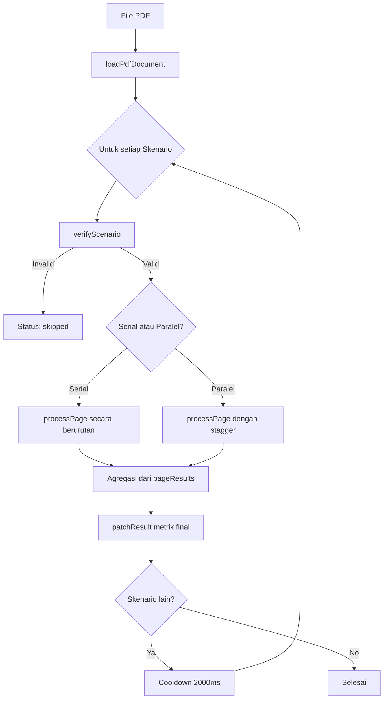

> **Sumber**: [`src/hooks/useBenchmark.ts`](https://github.com/msyamsudin/PustakaKu-MD/blob/main/src/hooks/useBenchmark.ts) + [`src/lib/utils/types.ts`](https://github.com/msyamsudin/PustakaKu-MD/blob/main/src/lib/utils/types.ts)
> **Versi**: v5 (2026-05-14)

> **Tujuan**: Referensi audit untuk model AI dan developer dalam meninjau akurasi metrik benchmark.
---

## 1. Ikhtisar Sistem

Sistem benchmark mengukur performa model AI vision dalam mengekstraksi markdown dari gambar halaman PDF. Sistem mendukung berbagai penyedia (Ollama, OpenRouter, Google, Anthropic), tiga mode transportasi gambar, serta eksekusi serial maupun paralel.

### Diagram Arsitektur



### Definisi Tipe Data

```typescript
// src/lib/utils/types.ts

export interface BenchmarkScenario {
  id: string;              // contoh: "google-base64", "openrouter-supabase"
  label: string;           // Nama yang mudah dibaca
  provider: Provider;
  imageInputMode: ImageInputMode;
}

export type BenchmarkStatus = "pending" | "running" | "done" | "error" | "skipped" | "partial";

/** Hasil per halaman yang dikumpulkan selama ekstraksi batch */
export interface BenchmarkPageResult {
  pageNum: number;
  uploadDurationMs?: number;   // fase encode / upload untuk halaman ini
  ttftMs?: number;             // time-to-first-token
  durationMs?: number;         // total waktu untuk halaman ini
  promptTokens?: number;
  completionTokens?: number;
  requestPayloadKb?: number;   // ukuran request body AI final (metadata + image/url)
  imageSizeKb?: number;        // ukuran mentah data gambar
  payloadEfficiency?: number;  // (imageSize - payloadSize) / imageSize * 100
  width?: number;
  height?: number;
  markdown?: string;
  cost?: number;               // biaya dari API untuk halaman ini (USD)
  errorMessage?: string;
}
```

---

## 2. Validasi Pra-Eksekusi (`verifyScenario`)

Sebelum skenario berjalan, kredensial dan konfigurasi model divalidasi. Skenario akan **di-skip** (bukan error) jika validasi gagal.

| Provider | Field Wajib | Catatan |
|---|---|---|
| `google` | `googleApiKey` | Model dicek via `googleModel || selectedModel` |
| `anthropic` | `anthropicApiKey` | Model dicek via `anthropicModel || selectedModel` |
| `openrouter` | `openRouterKey` + model | Validasi juga config Supabase jika `imageInputMode === "supabase"` |
| `ollama` | `ollamaModel || selectedModel` | Tidak butuh API key (lokal). Langsung return `{ valid: true }`. |

### Kode Sumber

```typescript
// useBenchmark.ts L33-87
export function verifyScenario(
  scenario: BenchmarkScenario
): { valid: boolean; reason?: string } {
  const cfg = getConfig();

  if (scenario.provider === "google") {
    if (!cfg.googleApiKey?.trim()) {
      return { valid: false, reason: "Google API Key not configured in Settings." };
    }
  }

  if (scenario.provider === "anthropic") {
    if (!cfg.anthropicApiKey?.trim()) {
      return { valid: false, reason: "Anthropic API Key not configured in Settings." };
    }
  }

  if (scenario.provider === "ollama") {
    if (!cfg.ollamaModel?.trim() && !cfg.selectedModel?.trim()) {
      return { valid: false, reason: "Ollama model not configured in Settings." };
    }
    return { valid: true };
  }

  // ... (OpenRouter logic)

  // Final: pastikan setidaknya satu model bisa di-resolve untuk provider ini
  // (selaras dengan logika resolusi model di runBenchmark)
  const resolvedModel =
    (scenario.provider === "google" && cfg.googleModel?.trim()) ||
    (scenario.provider === "openrouter" && cfg.openRouterModel?.trim()) ||
    (scenario.provider === "anthropic" && cfg.anthropicModel?.trim()) ||
    cfg.selectedModel?.trim();

  if (!resolvedModel) {
    return { valid: false, reason: "No model selected in Settings." };
  }

  return { valid: true };
}
```

---

## 3. Mode Input Gambar

Setiap skenario menentukan bagaimana gambar dikirim ke AI provider:

| Mode | Transportasi | Nilai `base64Image` | Nilai `imageUrl` | Ukuran `requestPayloadKb` |
|---|---|---|---|---|
| `base64` | Inline Base64 | Data URI lengkap | `undefined` | Ukuran string Base64 |
| `supabase` | Signed URL | `""` (kosong) | URL Supabase | Ukuran string URL |
| `google_files` | Google Files API | `""` (kosong) | URI file Google | Ukuran string URI |

---

## 4. Arsitektur Timing

### A. Diagram Siklus Hidup Halaman

```
│◀──────────── durationMs ──────────────────────────────────────▶│
│                                                                 │
│◀── uploadDurationMs ──▶│◀────────── Siklus Hidup AI ───────────▶│
│                        │                                        │
│  render + encode/upload│  request ──▶ TTFT ──▶ stream ──▶ done  │
│                        │            │                           │
uploadStart          aiStart     firstChunk              completion
```

### B. Timestamp Utama (per halaman)

| Variabel | Kapan Diatur | Apa yang Diukur |
|---|---|---|
| `uploadStart` | Sebelum persiapan gambar dimulai | Awal fase persiapan + upload |
| `aiStart` | Setelah upload, sebelum `extractMarkdown()` | Awal siklus request AI |
| `firstChunk` | Callback `onChunk` pertama dipicu | Kedatangan token stream pertama |
| `uploadDurationMs` | `performance.now() - uploadStart` | Durasi fase persiapan + upload saja |
| `ttftMs` | `performance.now() - aiStart` | Waktu dari request AI hingga token pertama |
| `durationMs` | `performance.now() - uploadStart` | **Total** waktu wall-clock untuk halaman ini |

---

## 5. Model Konkurensi

### A. Mode Serial
Halaman diproses satu per satu dalam loop `for`. Keluar lebih awal jika user menekan `stopBenchmark()` atau membatalkan proses.

### B. Mode Paralel (Staggered Pool)

```typescript
// useBenchmark.ts L401-410
if (options?.isParallel) {
  const tasks = Array.from({ length: pageNums.length }, async (_, i) => {
    if (i > 0) await new Promise(r => setTimeout(r, i * STAGGER_MS));
    return processPage(i);
  });
  await Promise.all(tasks);
}
```

- **`STAGGER_MS`**: `200ms` — mencegah hantaman API simultan yang bisa memicu rate limit.

---

## 6. Formula Statistik

### A. Tokens Per Second (TPS)

Kecepatan dihitung berdasarkan berapa banyak token yang dihasilkan dalam satu detik:

1. **Mode Serial (Kecepatan Model)**
   Dihitung dengan menjumlahkan token dari semua halaman yang sukses, lalu dibagi dengan total durasi bersih (durasi total dikurangi waktu persiapan/upload).
   > **Konsep**: `Total Token` ÷ `Total Waktu Generasi`

2. **Mode Paralel (Throughput Sistem)**
   Mengukur performa sistem secara keseluruhan. Dihitung dengan membagi total token dengan rentang real time (*wall-clock*) dari saat halaman pertama mulai hingga halaman terakhir selesai.
   > **Konsep**: `Total Token` ÷ `Durasi Total Proses (Wall-clock)`

> [!IMPORTANT]
> Dalam mode paralel, penyebutnya adalah rentang wall-clock dari mulai halaman pertama hingga akhir halaman terakhir. Ini mengukur berapa banyak token yang dihasilkan sistem per detik secara real time.

---

## 7. Pelacakan Biaya (Cost Tracking)

- **Sumber**: Field `cost` yang dikembalikan oleh `extractMarkdown()` dari respon API.
- **Penyimpanan**: `pageResult.cost = result.cost` — disimpan per halaman untuk transparansi.
- **Agregasi**: Diturunkan dari `successPages` saat agregasi final (tanpa mutable accumulator).

```typescript
// useBenchmark.ts L426-430 — Agregasi final dari pageResults
const costPages = successPages.filter(p => typeof p.cost === 'number');
const estimatedCostUsd = costPages.length > 0
  ? costPages.reduce((acc, p) => acc + p.cost!, 0)
  : undefined;
```

---

## 8. Alur Abort & Stop

| Mekanisme | Cakupan | Cara |
|---|---|---|
| `stopBenchmark()` | Semua skenario tersisa | Set `stopRef.current = true` dan batalkan controller |
| `AbortController` signal | Call `extractMarkdown` halaman saat ini | Dikirim via opsi `signal` |

> [!NOTE]
> Halaman yang dibatalkan saat masuk (`processPage entry`) akan tetap mencatat diri mereka di `pageResults` dengan pesan "Stopped by user." Ini memastikan jumlah total halaman tetap konsisten (v5).

---

## 9. Batasan & Tradeoff Desain (v5)

1. **`durationMs` mencakup waktu upload**: Sengaja dilakukan agar `aiTime` bisa dihitung sebagai metrik turunan.
2. **Populasi σ, bukan sampel σ**: `calculateStdDev` membagi dengan `N`, bukan `N-1`.
3. **Display progress paralel**: Snapshot `pageResults` saat runtime mungkin sedikit tidak sinkron antar coroutine, tapi agregasi final selalu akurat.
4. **Data biaya tergantung provider**: Tidak semua provider mengembalikan data biaya. Ditampilkan sebagai "N/A" jika tidak ada.
5. **Fase Render tidak dihitung**: Waktu render gambar PDF dilakukan sebelum `uploadStart` dicatat, sehingga tidak masuk dalam durasi benchmark AI.
6. **Error Cleanup Supabase di-log**: Kegagalan menghapus file sementara di Supabase dicatat di log via `logger.warn` namun tidak menggagalkan benchmark.

---

## 10. Changelog (v5)

- **Refaktor Biaya**: Menghapus accumulator mutable; biaya kini dihitung dari `pageResults`.
- **Fix Validasi**: Pengecekan model akhir kini mendukung provider-specific model (misal `googleModel`).
- **Fix Abort**: Halaman yang di-skip saat abort kini tetap tercatat di `pageResults`.
- **Logging Cleanup**: Error penghapusan file Supabase kini dicatat di log.
- **Dokumentasi**: Menambahkan 8 poin perilaku sistem yang sebelumnya tidak terdokumentasi.

---

*Catatan Audit: Spesifikasi ini mencerminkan kode versi v5. Semua metrik diturunkan dari `pageResults` setelah selesai untuk menjamin konsistensi.*
